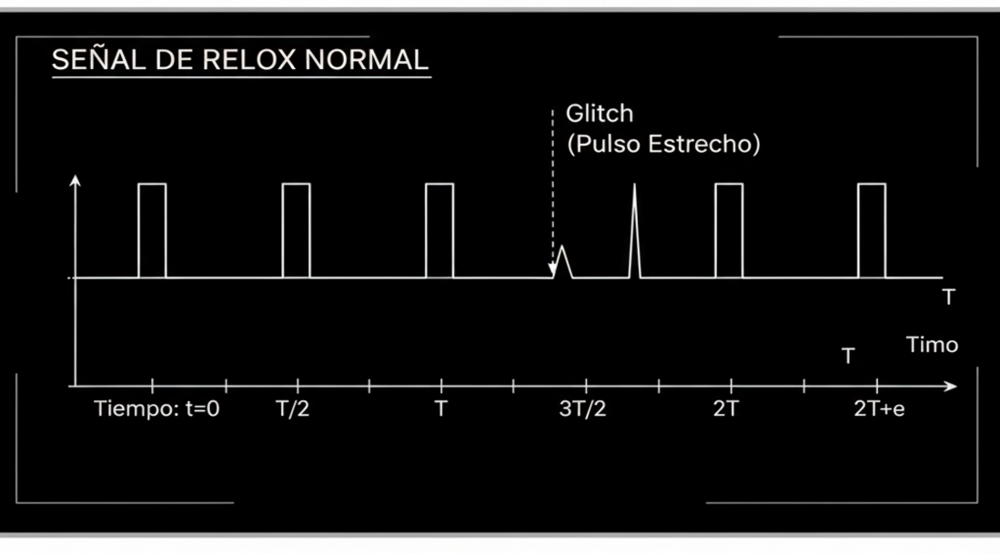

# Charla Glitching == Hardware Hacking ES


---
### Introducción
### Teoría de Ataques de canal paralelo
#### Glitch de Tensión
#### Glitch de Reloj
#### Ataques de Power Analisis
---

### Introducción


Los ataques de canal paralelo se suelen referir con el acrónimo SCA (Side Channel Attack).

Son una clase de ataques de ciberseguridad que se centran en cambiar el hilo
de computación de un sistema revisando las implementaciones físicas en lugar
de atacar la fortaleza matemática del algoritmo en sí.

Los intentos de analizar los efectos del glitching en el hardware están 
sujetos al efecto Heisenberg, por lo cual, al "introducir una sonda de medición"
estamos alterando automáticamente el medio físico del sistema estudiado.


===

### Teoría de los ataques de canal paralelo

Los ataques de canal paralelo persiguen forzar un fallo buscando un defecto hardware, y no un defecto en el software.

| Tipo de Ataque | Medida Colateral Explotada | Ejemplo de Información Inferencia |
| :--- | :--- | :--- |
| **Ataques de Sincronización (Timing Attacks)** | Tiempo que tarda el dispositivo en realizar distintas operaciones (cálculos, comparaciones, accesos a memoria). | Puede revelar la clave secreta al inferir qué operaciones se realizan más rápido o más lento dependiendo de los bits de la clave. |
| **Análisis de Consumo de Energía (Power Analysis)** | Variaciones en el consumo de energía eléctrica del dispositivo mientras realiza operaciones. | **DPA (Differential Power Analysis)** y **SPA (Simple Power Analysis)** correlacionan los picos de consumo con el procesamiento de bits específicos de la clave.  |
| **Análisis de Radiación Electromagnética (EM)** | Ondas de radio o campos electromagnéticos emitidos durante el procesamiento. | Permite deducir claves o textos planos al ser una manifestación física de la actividad interna. |
| **Ataques Acústicos** | Sonidos generados por los componentes (como bobinas o condensadores) durante el procesamiento de datos. | Se ha demostrado que pueden revelar claves criptográficas al analizar los patrones sonoros. |
| **Ataques de Caché (Cache Attacks)** | El atacante monitoriza los patrones de acceso a la memoria caché de la víctima en un sistema compartido. | Infiere qué datos están siendo procesados por la víctima al observar qué líneas de caché son usadas o desalojadas. |
| **Análisis de Fallos (Fault Analysis)** | Introduce fallos intencionados (ej. picos de voltaje, láseres) para que el cálculo criptográfico devuelva un resultado erróneo. | Ataque de Fallos Diferenciales (DFA) para deducir la clave. |

Los ataques de canal lateral a menudo requieren el uso de técnicas estadísticas avanzadas para extraer la información útil del "ruido" de la medición.

Correlación: Es la técnica central. El atacante realiza múltiples mediciones del canal lateral (ej. consumo de energía) mientras el sistema procesa diferentes entradas (ej. textos planos). Luego, intenta correlacionar las mediciones con las operaciones internas que se realizarían si la clave secreta fuera una clave conjeturada. La clave que muestre la correlación más alta es probablemente la correcta.

Análisis Diferencial: Se utiliza para amplificar las pequeñas diferencias en las mediciones que son causadas por la operación de bits específicos de la clave.

## ⚡ Glitch de Tensión

### 1. Marco Teórico: Inyección de Fallos

Un *crowbar glitch* se basa en el principio de la **Inyección de Fallos (Fault Injection - FI)**. El objetivo es obligar a un dispositivo a desviarse de su comportamiento intencionado mediante la alteración de su entorno físico o eléctrico.

* **Objetivo computacional:** Obligar al procesador a saltarse o ejecutar mal una instrucción clave (como una comparación de claves) o a producir un resultado criptográfico incorrecto del que se pueda inferir la clave secreta.
* **Objetivo de Seguridad:** Burlar mecanismos de protección de *hardware* o *software*, como verificaciones de contraseña, *checksums*, o la inicialización de estado de seguridad.

### 2. El Mecanismo "Crowbar" Glitch

El término "*crowbar*" se utiliza porque la técnica **cortocircuita o sobrecarga momentáneamente la línea de alimentación eléctrica** del circuito integrado (CI) objetivo.

#### **Funcionamiento Físico del Ataque**

1.  **Monitoreo Preciso:** Se identifica el **momento crítico (critical window)** en el que se ejecuta una instrucción sensible.
2.  **Activación del Glitch:** Un circuito de conmutación muy rápido (a menudo un MOSFET) es activado para **cortocircuitar la línea de voltaje VCC a tierra (GND)** por un periodo extremadamente corto (picosegundos a nanosegundos). 
3.  **El Efecto Eléctrico:** Este cortocircuito momentáneo provoca una **caída brusca e inmediata del voltaje de alimentación (VCC)** del chip.
4.  **El Efecto Lógico (El Fallo):** La caída de voltaje perturba el funcionamiento de los circuitos lógicos:
    * **Violación de Sincronización (Setup/Hold Time Violation):** Las celdas lógicas no reciben suficiente voltaje para cambiar su estado correctamente.
    * **Corrupción de Datos:** Los datos se corrompen en la memoria o en tránsito.
    * **Salto de Instrucción (Instruction Skip):** El procesador puede ejecutar mal o saltarse la instrucción que se estaba ejecutando, alterando el flujo del programa.


### 3. Parámetros Críticos del Ataque

El éxito depende de la manipulación precisa de tres parámetros:

1.  **Tiempo (Timing):** El factor más crítico, requiere precisión de nanosegundos para golpear la instrucción deseada.
2.  **Duración (Width):** El tiempo que dura el cortocircuito. Si es muy corto, no causa fallo; si es muy largo, reinicia el dispositivo.
3.  **Amplitud (Magnitude):** La cantidad de corriente que se desvía, determinando la magnitud de la caída de voltaje.
4.  **Número de repeticiones (Repeats):** cantidad de cortocircuitos necesarios para saltar una instrucción. 

### 4. Usos Comunes del Crowbar Glitch

* **Bypass de Comprobaciones:** Forzar que una comprobación de clave o PIN siempre resulte verdadera.
* **Inyección de Códigos de Operación (Opcode Injection):** Inducir un fallo para que el procesador ejecute una instrucción diferente (ej. un `NOP` o un salto).
* **Ataque DFA Mejorado:** Generar un texto cifrado con un fallo preciso para usar el **Análisis Diferencial de Fallos (DFA)** y deducir la clave.

### Contramedidas

Las defensas se centran en la inmunidad del *hardware* a las fluctuaciones:

* **Filtros de Voltaje:** Agregar condensadores de desacoplo de alta frecuencia cerca de los puntos sensibles.
* **Monitores de Voltaje (Voltage Detectors):** Circuitos que detectan si el VCC cae por debajo de un umbral seguro y activan un reinicio instantáneo (*reset*).
* **Redundancia Temporal/Espacial:** Ejecutar operaciones críticas varias veces y comparar resultados.

# ⏰ El Glitch de Reloj (Clock Glitch)

El *glitch de reloj* es una técnica de inyección de fallos hardware p en microcontroladores o procesadores, **interfiriendo temporalmente con su señal de reloj**.

## ¿Cómo Funciona?

Un circuito digital síncrono utiliza una señal de reloj ($f_{clk}$) para dictar el ritmo de sus operaciones.

Para realizar una inyección en este ataque es necesario disponer de una fuente de reloj mucho más rápida, del orden de 10 veces más rápida que el reloj objetivo debido al teorema de Nyquist, para asegurar el momento de disparo.

Este tipo de ataque presenta ventajas con respecto a los Glitches de tensión. 
* **Precisión:** asegura el momento del disparo.
* **Control:** puede forzar un cambio concreto en la instrucción procesada. 

Esto posibilita forzar un cambio de 1 bit en la instrucción / OPCode que se está procesando en ese momento como por ejemplo:

* **Opcodes Vecinos a `280A` (CMP R0, #10)**

El *opcode* `280A` (binario 0010100000001010) corresponde a la instrucción **`CMP R0, #10`** en el conjunto de instrucciones Thumb-2 del ARM Cortex-M3.

El siguiente análisis muestra las 16 posibles instrucciones resultantes de cambiar **un solo bit** en el código binario. Este es un escenario clave para entender la vulnerabilidad a fallos de un solo bit (como los causados por un *glitch de reloj*).

| Bit Modificado | Nuevo Opcode (Hex) | Mnemónico ASM Resultante | Operación y Consecuencia Crítica |
| :--- | :--- | :--- | :--- |
| **Bit 11** | `2**0**0A` | `MOVS R0, #10` | **Cambia la operación:** Mueve el valor 10 a R0. **Corrompe el valor de R0.** |
| **Bit 10** | `2**C**0A` | `ADDS R0, R0, #10` | **Cambia la operación:** Suma 10 a R0. **Corrompe el valor de R0.** |
| **Bit 9** | `2**A**0A` | `SUBS R0, R0, #10` | **Cambia la operación:** Resta 10 a R0. **Corrompe el valor de R0.** |
| **Bit 8** | `290A` | `CMP R1, #10` | **Cambia el registro:** Compara R1 en lugar de R0. **Salta la comprobación deseada.** |
| **Bit 7** | `288A` | `CMP R0, #138` | **Cambia el Inmediato:** Compara con 138 (0x8A). |
| **Bit 6** | `284A` | `CMP R0, #74` | **Cambia el Inmediato:** Compara con 74 (0x4A). |
| **Bit 5** | `282A` | `CMP R0, #42` | **Cambia el Inmediato:** Compara con 42 (0x2A). |
| **Bit 4** | `281A` | `CMP R0, #26` | **Cambia el Inmediato:** Compara con 26 (0x1A). |
| **Bit 3** | `2802` | `CMP R0, #2` | **Cambia el Inmediato:** Compara con 2 (0x02). |
| **Bit 2** | `2806` | `CMP R0, #6` | **Cambia el Inmediato:** Compara con 6 (0x06). |
| **Bit 1** | `2808` | `CMP R0, #8` | **Cambia el Inmediato:** Compara con 8 (0x08). |
| **Bit 0** | `280B` | `CMP R0, #11` | **Cambia el Inmediato:** Compara con 11 (0x0B). |

Los cambios en los bits 9, 10 y 11 son los más peligrosos porque alteran la instrucción de una operación

## Parámetros clave

Los parámetro que determinan este tipo de ataques son:

1.  **Aislamiento:** Obtener acceso físico al pin de reloj del circuito.
2.  **Inyección:** En un momento crítico (ejecución de una comprobación de seguridad), se inyecta un **pulso de reloj anormalmente corto** (un *glitch*).
3.  **Fallo por Tiempo:** Este pulso estrecho ($T_{glitch} \ll T_{clk}$) viola los tiempos mínimos de configuración o retención de los *flip-flops*, causando un **estado indeterminado** y un fallo controlado.

## Consecuencias del Ataque

Un *glitch* ejecutado con precisión puede:

* **Omisión de Instrucciones:** El procesador salta una instrucción de seguridad crucial.
* **Derivación de Condiciones:** El programa ejecuta directamente el código que debería estar protegido sin pasar la verificación.

## Diagrama de la Inyección del Clock Glitch


Este diagrama ilustra la diferencia entre la señal de reloj normal y el pulso intencionalmente acortado que causa el fallo.

## Medidas de Mitigación contra el Clock Glitching

Los fabricantes de hardware y los diseñadores de *firmware* implementan varias contramedidas para hacer que los ataques de *clock glitching* sean más difíciles, o incluso imposibles, de ejecutar con éxito.

### 1. Protección a Nivel de Hardware

Estas defensas están integradas directamente en el diseño del circuito (ASIC o FPGA).

* **Detección de Frecuencia/Periodo del Reloj (Clock Monitoring):**
    * Se incluye un circuito de vigilancia (*watchdog*) que mide el periodo (o la frecuencia) del pulso de reloj.
    * Si detecta que un pulso es significativamente más corto de lo esperado (un *glitch*), asume que hay un ataque.
    * **Acción:** El chip puede apagarse inmediatamente, entrar en modo de reinicio seguro o borrar claves secretas almacenadas en SRAM volátil.

* **Filtros de Reloj (Clock Filters):**
    * Se utilizan filtros de paso bajo o circuitos *debounce* para suavizar las irregularidades en la señal de reloj.
    * Estos filtros están diseñados para ignorar picos de ruido muy cortos, lo que hace que los pulsos de *glitch* estrechos no sean lo suficientemente potentes para afectar la lógica interna.

* **Rutas de Reloj Redundantes (Redundant Clock Paths):**
    * Algunos diseños críticos utilizan múltiples generadores de reloj (o una malla de reloj más compleja) para que un *glitch* inyectado en una sola línea no pueda afectar a todas las unidades funcionales del chip simultáneamente.

### 2. Protección a Nivel de Software/Firmware

Estas defensas se implementan en el código que se ejecuta en el chip.

* **Instrucciones de Redundancia y Duplicación:**
    * Las comprobaciones de seguridad críticas (como la verificación de la contraseña) se realizan **dos veces** y se comparan los resultados.
    * Si un *glitch* salta la primera comprobación, es muy poco probable que también salte la segunda.
    * **Ejemplo:** En lugar de `if (password_ok)`, se hace:
        ```c
        if (password_ok()) {
            if (password_ok()) {
                // Proceder solo si ambas son correctas
            } else {
                // Fallo o ataque
            }
        }
        ```

* **Comprobaciones de Temporización (Timing Checks):**
    * Se utiliza un temporizador interno (ajeno al reloj principal atacado) para medir el tiempo que tarda en ejecutarse una sección de código crítica.
    * Si la ejecución es demasiado rápida (indicando que se saltaron instrucciones por un *glitch*), se asume un fallo y se bloquea el acceso.

* **Uso de Lógica Asíncrona para Comprobaciones:**
    * Las operaciones de seguridad más críticas se realizan en módulos de hardware que operan **asincrónicamente** o que utilizan una fuente de reloj diferente (como un *ring oscillator*), haciéndolos inmunes al *glitch* del reloj principal.